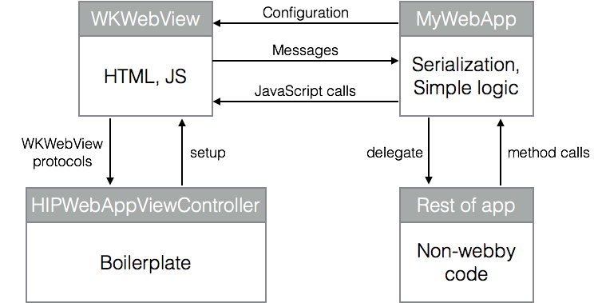

# HIPWebApp: WKWebView design patterns


[Docs (you may already be here)](http://hipmunk.github.io/HIPWebApp/)

[Examples](https://github.com/Hipmunk/HIPWebApp/tree/master/HIPWebAppDemo/Examples)

HIPWebApp is a set of protocols and classes for Swift and iOS that removes a
lot of boilerplate from the process of creating and configuring a `WKWebView`.
It encourages you to create a dedicated "web app" object whose only job is to
be the interface between your web code and your native code.

At Hipmunk, we've been experimenting with ways to integrate web-based views
into our app without providing a bad experience for users. To us, that means
tight integration between the code running in the web view and the native parts
of our app. Using this pattern has helped us do that without leaving behind
a pile of spaghetti code.

The source code comes with a few examples.


## Installation with Carthage


Add this line to your `Cartfile`:

```
github "hipmunk/HIPWebApp" ~> 1.0
```


## Usage

First, make a class that implements `WebApp`. The only hard requirements are a string
identifier for logging (`appIdentifier`) and an initial URL.

```swift
import Foundation
import HIPWebApp


class SimplestExampleWebApp: WebApp {
    let appIdentifier = "google"
    let initialURL = NSURL(string: "https://google.com")!
}
```

Then you need a subclass of `WebAppViewController` to host it. Here is the
minimum viable subclass:


```swift
import UIKit
import HIPWebApp


class SimplestExampleWebAppViewController: WebAppViewController {

    override func createWebApp() -> WebApp { return SimplestExampleWebApp() }

    override func viewDidLoad() {
        // optional: set self.WebAppViewControllerLoggingDelegate to enable logging

        super.viewDidLoad()

        self.loadWebAppInitialURL()
    }

}
```

You are now done!

If you want to do more, you'll need to implement one or more of these
protocols:

* `WebAppWebViewReferencing` gives you an opportunity to store a reference
  to the web view. While this is a very common thing to do, it isn't strictly
  necessary.
* `WebAppConfiguring` lets you provide a `WKWebViewConfiguration`, meaning
  you can add user scripts and more.
* `WebAppNavigating` lets you provide a navigation delegate.
* `WebAppMessageHandling` lets you listen for calls to
  `messageHandlers[messageName].postMessage(messageBody)`.

See `HIPWebApp/WebApp.swift` and `HIPWebAppDemo/Examples` for details.

## Concepts

Here is a potentially helpful diagram about how the different classes and
protocols are related.



## Further reading

* [The official `WKWebView` docs](https://developer.apple.com/library/ios/documentation/WebKit/Reference/WKWebView_Ref/)
* [`WKWebView` at NSHipster](http://nshipster.com/wkwebkit/)

## Release history

### 1.0

Initial release.
